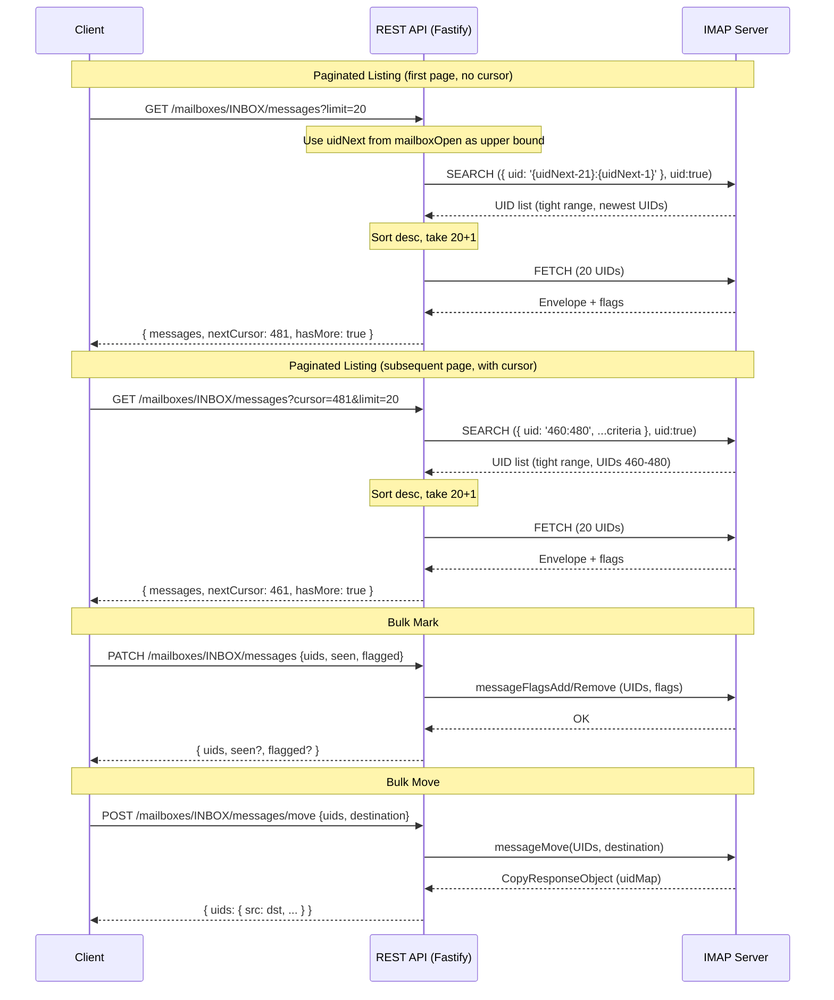

# Design Document — Paginated Listing & Bulk Operations

## Overview

This design adds cursor-based pagination to the message listing and search endpoints, and introduces bulk flag/move/copy operations — all on the existing stateless Fastify + ImapFlow architecture. The MCP server is updated to expose the new capabilities as tools for AI agents.

Cursor-based pagination uses IMAP UIDs as cursors. UIDs are monotonically increasing within a mailbox (highest UID = most recent message), so the first page returns the newest messages and subsequent pages walk backward through older ones. The cursor is a UID boundary — the next page fetches UIDs strictly less than the cursor. Crucially, the UID range filtering is pushed down to the IMAP server via ImapFlow's `{ uid: '1:{cursor-1}' }` search criteria, avoiding fetching all UIDs client-side. The bulk endpoints leverage ImapFlow's native array-of-UIDs support for `messageFlagsAdd`, `messageFlagsRemove`, `messageMove`, and `messageCopy`, keeping the implementation thin.

### Key Design Decisions

1. **UID-as-cursor with tight IMAP-level range filtering** — UIDs are stable, server-assigned, and monotonically increasing per mailbox (highest = newest). The cursor is the lowest UID on the current page; the next page asks the IMAP server for UIDs in a tight window via `search({ uid: '{cursor-limit-1}:{cursor-1}' })`. This avoids fetching all UIDs — only the narrow range around the page boundary is queried. For the first page (no cursor), we use `client.mailbox.uidNext` (available after `mailboxOpen`) as the upper bound, searching `{ uid: '{uidNext-limit-1}:{uidNext-1}' }` — so even the first page avoids scanning the entire mailbox. Since UIDs can have gaps (deleted messages), the range may return fewer than `limit` results; this is fine — the client gets a shorter page and pages again.

2. **Response shape change** — The listing and search endpoints currently return a bare JSON array. They will return `{ messages, nextCursor, hasMore }` instead. This is a breaking change for existing consumers but is required by the requirements.

3. **Single bulk PATCH endpoint** — Rather than separate endpoints for seen and flagged, a single `PATCH /mailboxes/:mailbox/messages` accepts `uids` plus optional `seen` and/or `flagged` booleans. This maps cleanly to independent ImapFlow flag calls and avoids endpoint proliferation.

4. **Bulk move/copy as new collection-level routes** — `POST /mailboxes/:mailbox/messages/move` and `POST /mailboxes/:mailbox/messages/copy` operate on arrays of UIDs. The existing single-message routes at `/:uid/move` and `/:uid/copy` remain unchanged for backward compatibility. All bulk endpoints cap the `uids` array at 100 entries to prevent abuse and avoid long-running IMAP commands.

5. **Atomic IMAP operations** — ImapFlow's `messageMove`, `messageCopy`, `messageFlagsAdd`, and `messageFlagsRemove` each send a single IMAP command for all UIDs. The IMAP server processes the batch atomically — there's no partial failure at the protocol level. UIDs that don't exist in the mailbox are silently skipped by the server; the response only includes entries for UIDs that were actually processed.

6. **Limit cap at 100** — Prevents clients from requesting unbounded fetches or bulk operations. Default page size remains 50.

## Architecture

The architecture stays the same: stateless per-request IMAP connections, Fastify route plugins, and the MCP server as a thin HTTP proxy. The changes are additive — new route handlers and updated query parameter handling.



### Pagination Flow Detail

1. Client sends `GET /mailboxes/:mailbox/messages?cursor=C&limit=L`
2. Route handler extracts credentials, opens mailbox
3. Build search criteria:
   - **No cursor (first page):** use `client.mailbox.uidNext` (available after `mailboxOpen`) as the upper bound. Search with `{ uid: '{max(1, uidNext-L-1)}:{uidNext-1}' }` merged with any base criteria. This fetches only the newest UIDs without scanning the entire mailbox.
   - **With cursor:** merge `{ uid: '{max(1, C-L-1)}:{C-1}' }` into the search criteria. This asks the IMAP server for only the tight window of UIDs just below the cursor.
4. Run `client.search(criteria, { uid: true })` — returns matching UIDs within the requested range
5. Sort returned UIDs descending (newest first), slice to `L + 1` entries
6. If `L + 1` entries exist → `hasMore = true`, `nextCursor = UIDs[L-1]` (the L-th item), return first L messages
7. Otherwise → `hasMore = false`, `nextCursor = null`, return all messages
8. Fetch envelopes/flags only for the page-sized UID slice via `client.fetch()`

The tight UID range keeps the IMAP search efficient — instead of scanning all UIDs in the mailbox, only the narrow window around the page boundary is queried. The "+1 overfetch" is on the UID list only; the expensive `fetch()` call runs for the actual page size.

**Note on UID gaps:** Because deleted messages leave gaps in the UID sequence, a tight range may occasionally return fewer than `limit` messages. This is acceptable — the client receives a shorter page and can page again. No data is lost or skipped.

## Components and Interfaces

### REST API Changes

#### Modified: `GET /mailboxes/:mailbox/messages`

New query parameters:
- `cursor` (optional, positive integer) — UID cursor; return messages with UID < cursor
- `limit` (optional, positive integer, max 100, default 50) — page size

New response shape:
```json
{
  "messages": [
    { "uid": 499, "from": "...", "subject": "...", "date": "...", "seen": false }
  ],
  "nextCursor": 480,
  "hasMore": true
}
```

#### Modified: `GET /mailboxes/:mailbox/messages/search`

Same `cursor` and `limit` parameters added. Same paginated response shape.

#### New: `PATCH /mailboxes/:mailbox/messages`

Request body:
```json
{
  "uids": [10, 20, 30],
  "seen": true,
  "flagged": false
}
```

Response (200):
```json
{
  "uids": [10, 20, 30],
  "seen": true,
  "flagged": false
}
```

At least one of `seen` or `flagged` must be present. Each triggers an independent ImapFlow call (`messageFlagsAdd` or `messageFlagsRemove`).

#### New: `POST /mailboxes/:mailbox/messages/move`

Request body:
```json
{
  "uids": [10, 20, 30],
  "destination": "Archive"
}
```

Response (200):
```json
{
  "uids": { "10": 101, "20": 102, "30": 103 }
}
```

#### New: `POST /mailboxes/:mailbox/messages/copy`

Same shape as move. Uses `client.messageCopy()` instead.

### MCP Server Changes

| Tool | Change |
|------|--------|
| `list_messages` | Add optional `cursor` param; forward as query param |
| `search_messages` | Add optional `cursor` param; forward as query param |
| `bulk_mark_messages` (new) | Accepts `mailbox`, `uids`, optional `seen`, optional `flagged`; delegates to `PATCH /mailboxes/:mailbox/messages` |
| `bulk_move_messages` (new) | Accepts `mailbox`, `uids`, `destination`; delegates to `POST /mailboxes/:mailbox/messages/move` |
| `bulk_copy_messages` (new) | Accepts `mailbox`, `uids`, `destination`; delegates to `POST /mailboxes/:mailbox/messages/copy` |

### Route File Organization

- Pagination logic is added inline to the existing handlers in `messages.ts` and `search.ts`
- A new route file `rest/src/routes/bulk.ts` houses the bulk PATCH, bulk move, and bulk copy handlers
- `rest/src/app.ts` registers the new `bulkRoutes` plugin
- A shared validation helper for UID arrays can live in `rest/src/lib/validate.ts`

## Data Models

### Pagination Query Parameters

```typescript
interface PaginationParams {
  cursor?: string;  // query params are strings; parsed to number
  limit?: string;
}
```

### Paginated Response

```typescript
interface PaginatedResponse<T> {
  messages: T[];
  nextCursor: number | null;
  hasMore: boolean;
}
```

### Bulk Mark Request/Response

```typescript
interface BulkMarkBody {
  uids: number[];
  seen?: boolean;
  flagged?: boolean;
}

interface BulkMarkResponse {
  uids: number[];
  seen?: boolean;
  flagged?: boolean;
}
```

### Bulk Move/Copy Request/Response

```typescript
interface BulkMoveCopyBody {
  uids: number[];
  destination: string;
}

interface BulkMoveCopyResponse {
  uids: Record<string, number>;  // sourceUid → destinationUid
}
```

### Validation Helper

```typescript
// rest/src/lib/validate.ts
function validateUidArray(uids: unknown): number[];
function validatePaginationParams(cursor?: string, limit?: string): { cursor?: number; limit: number };
```


## Correctness Properties

*A property is a characteristic or behavior that should hold true across all valid executions of a system — essentially, a formal statement about what the system should do. Properties serve as the bridge between human-readable specifications and machine-verifiable correctness guarantees.*

### Property 1: Cursor filtering returns only older messages in descending order

*For any* set of IMAP UIDs and *for any* valid cursor value C, applying cursor-based pagination SHALL return only UIDs strictly less than C, and those UIDs SHALL be sorted in descending order.

**Validates: Requirements 1.1, 3.1**

### Property 2: Pagination metadata is consistent with remaining results

*For any* set of IMAP UIDs, *for any* valid cursor (or no cursor), and *for any* valid limit L: if more UIDs exist beyond the returned page then `hasMore` SHALL be `true` and `nextCursor` SHALL equal the UID of the last message in the page; otherwise `hasMore` SHALL be `false` and `nextCursor` SHALL be `null`.

**Validates: Requirements 1.5, 1.6, 1.7, 3.3**

### Property 3: Page size never exceeds limit

*For any* set of IMAP UIDs and *for any* valid limit L (1 ≤ L ≤ 100), the number of messages returned in a single page SHALL be at most L.

**Validates: Requirements 1.3, 3.4**

### Property 4: Invalid pagination parameters are rejected

*For any* cursor value that is not a positive integer, or *for any* limit value that is not a positive integer or exceeds 100, the endpoint SHALL respond with HTTP 400.

**Validates: Requirements 2.1, 2.2, 2.3**

### Property 5: Invalid UID arrays are rejected

*For any* request body where `uids` is missing, not an array, an empty array, or contains any value that is not a positive integer, the bulk mark, bulk move, and bulk copy endpoints SHALL respond with HTTP 400.

**Validates: Requirements 4.3, 4.4, 5.3, 5.4, 10.3, 10.4, 11.3, 11.4**

### Property 6: Bulk flag operations dispatch correct ImapFlow calls

*For any* non-empty array of valid UIDs and *for any* combination of `seen` (boolean) and/or `flagged` (boolean), the bulk mark endpoint SHALL call `messageFlagsAdd` with `\Seen` when `seen` is true, `messageFlagsRemove` with `\Seen` when `seen` is false, `messageFlagsAdd` with `\Flagged` when `flagged` is true, and `messageFlagsRemove` with `\Flagged` when `flagged` is false. The response SHALL echo back the UIDs and the applied flag values.

**Validates: Requirements 4.1, 4.2, 5.1, 5.2, 6.1, 6.2**

### Property 7: Bulk move delegates to ImapFlow and returns UID mapping

*For any* non-empty array of valid UIDs and *for any* valid destination mailbox (different from source), the bulk move endpoint SHALL call `client.messageMove(uids, destination)` and return a mapping of source UIDs to destination UIDs.

**Validates: Requirements 10.1, 10.2**

### Property 8: Bulk copy delegates to ImapFlow and returns UID mapping

*For any* non-empty array of valid UIDs and *for any* valid destination mailbox, the bulk copy endpoint SHALL call `client.messageCopy(uids, destination)` and return a mapping of source UIDs to destination UIDs.

**Validates: Requirements 11.1, 11.2**

## Error Handling

| Scenario | HTTP Status | Error Message |
|----------|-------------|---------------|
| Missing IMAP credential headers | 401 | "Missing required headers: ..." |
| Invalid `cursor` (not positive integer) | 400 | "'cursor' must be a positive integer" |
| Invalid `limit` (not positive integer) | 400 | "'limit' must be a positive integer" |
| `limit` exceeds 100 | 400 | "'limit' must not exceed 100" |
| `uids` missing, not array, or empty | 400 | "A non-empty array of UIDs is required" |
| `uids` contains non-positive-integer | 400 | "All UIDs must be positive integers" |
| `uids` array exceeds 100 entries | 400 | "Maximum 100 UIDs per request" |
| Neither `seen` nor `flagged` provided | 400 | "At least one of 'seen' or 'flagged' is required" |
| `seen` is not a boolean | 400 | "'seen' must be a boolean" |
| `flagged` is not a boolean | 400 | "'flagged' must be a boolean" |
| `destination` missing or empty | 400 | "'destination' is required" |
| Source and destination are the same (move) | 400 | "Source and destination mailbox must differ" |
| Destination mailbox not found | 404 | "Destination mailbox not found" |
| IMAP connection failure | 500 | Fastify default error handler |

All new endpoints follow the existing pattern: `CredentialError` → 401, validation errors → 400, IMAP `TRYCREATE` errors → 404, unhandled errors propagate to Fastify's default 500 handler. The IMAP client is always disconnected in a `finally` block.

## Testing Strategy

### Unit Tests (Jest + app.inject)

Follow the existing project pattern: mock `imapLib.createImapClient` and `imapLib.disconnectImapClient`, then use `app.inject()` for in-process HTTP testing.

**Pagination tests** (`rest/test/routes/messages-pagination.test.ts`):
- 401 without credentials
- Default limit of 50 when omitted
- Cursor filtering (only UIDs < cursor returned)
- Response shape `{ messages, nextCursor, hasMore }`
- `hasMore: false` and `nextCursor: null` on last page
- 400 for invalid cursor, invalid limit, limit > 100

**Search pagination tests** (`rest/test/routes/search-pagination.test.ts`):
- Same pagination tests applied to the search endpoint
- Cursor combined with search criteria

**Bulk mark tests** (`rest/test/routes/bulk-mark.test.ts`):
- 401 without credentials
- 400 for missing/empty/invalid uids
- 400 for missing seen and flagged
- 400 for non-boolean seen or flagged
- 200 with seen=true calls `messageFlagsAdd` with `\Seen`
- 200 with seen=false calls `messageFlagsRemove` with `\Seen`
- 200 with flagged=true calls `messageFlagsAdd` with `\Flagged`
- 200 with both seen and flagged applies both
- Partial success when some UIDs don't exist

**Bulk move tests** (`rest/test/routes/bulk-move.test.ts`):
- 401 without credentials
- 400 for missing/empty/invalid uids
- 400 for missing destination, same source/destination
- 404 for non-existent destination
- 200 with UID mapping on success

**Bulk copy tests** (`rest/test/routes/bulk-copy.test.ts`):
- Same validation tests as move (minus same-source check)
- 200 with UID mapping on success

### Property-Based Tests (fast-check)

Property-based tests use [fast-check](https://github.com/dubzzz/fast-check) to verify the correctness properties above. Each property test runs a minimum of 100 iterations with randomly generated inputs.

The pagination logic should be extracted into a pure function (`paginateUids`) in `rest/src/lib/paginate.ts` so it can be tested directly without HTTP overhead. This function takes a UID array (as returned by IMAP search — already filtered by UID range when a cursor was provided), an optional cursor for validation, and a limit. It sorts descending (newest first), applies the +1 overfetch logic, and returns `{ uids: number[], nextCursor: number | null, hasMore: boolean }`.

A companion helper `buildUidRangeCriteria(cursor: number | undefined, limit: number, uidNext: number)` computes the tight UID range. When cursor is provided, it returns `{ uid: '{max(1, cursor-limit-1)}:{cursor-1}' }`. When no cursor is provided (first page), it uses uidNext as the upper bound: `{ uid: '{max(1, uidNext-limit-1)}:{uidNext-1}' }`. Both cases keep the IMAP search scoped to a narrow window.

The UID array validation should be extracted into `rest/src/lib/validate.ts` as a pure function so it can be property-tested directly.

**Property test files:**
- `rest/test/lib/paginate.property.test.ts` — Properties 1, 2, 3 (cursor filtering, metadata consistency, limit enforcement)
- `rest/test/lib/validate.property.test.ts` — Properties 4, 5 (pagination param validation, UID array validation)
- `rest/test/routes/bulk-mark.property.test.ts` — Property 6 (flag dispatch)
- `rest/test/routes/bulk-move.property.test.ts` — Property 7 (move delegation)
- `rest/test/routes/bulk-copy.property.test.ts` — Property 8 (copy delegation)

Each test is tagged with: `Feature: pagination-and-bulk-operations, Property N: <title>`

**fast-check configuration:**
```typescript
fc.assert(
  fc.property(/* arbitraries */, (/* args */) => {
    // property assertion
  }),
  { numRuns: 100 }
);
```
