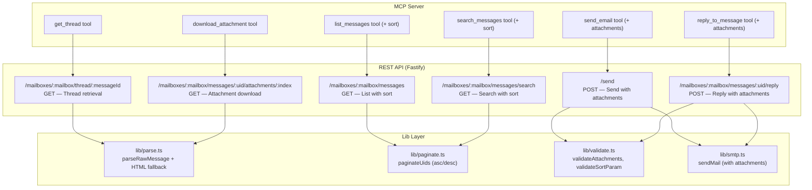

# Design — Threads, Attachments, Sort Order & HTML Body Fix

## Overview

This feature adds five capabilities to the imaprest REST API and MCP server:

1. **Thread retrieval** — A new endpoint `GET /mailboxes/:mailbox/thread/:messageId` resolves a conversation thread. When the IMAP server advertises the `THREAD=REFERENCES` capability (RFC 5256), the endpoint uses the native `UID THREAD REFERENCES` command for efficient server-side threading. When the capability is absent, it falls back to client-side resolution by walking the Message-ID / In-Reply-To / References graph. Both paths return the full thread sorted chronologically. A corresponding `get_thread` MCP tool wraps it.

2. **Attachment download** — A new endpoint `GET /mailboxes/:mailbox/messages/:uid/attachments/:index` streams a specific attachment's binary content with correct MIME headers. A `download_attachment` MCP tool returns the content as base64.

3. **Send/reply with attachments** — The existing `/send` and `/reply` endpoints accept an optional `attachments` array of `{ filename, contentType, content }` objects (content is base64-encoded). The MCP `send_email` and `reply_to_message` tools gain a matching optional parameter.

4. **Ascending sort** — A `sort=asc` query parameter on the list and search endpoints returns messages in ascending UID order (oldest first) with forward-walking cursor pagination. The MCP `list_messages` and `search_messages` tools gain an optional `sort` parameter.

5. **HTML-only body fix** — `parseRawMessage` in `rest/src/lib/parse.ts` is updated so that when a message has HTML but no plain-text part, the `text` field is populated with a tag-stripped plain-text extraction from the HTML instead of returning `null`.

All changes follow the existing stateless per-request credential model, Fastify plugin pattern, and IMAP client lifecycle (create → use → disconnect in `finally`).

## Architecture



### Thread Resolution Algorithm

The thread endpoint uses a two-tier strategy: native IMAP THREAD when available, with a client-side fallback.

#### Strategy 1: Native IMAP THREAD (preferred)

ImapFlow does not expose a high-level `thread()` method, but its internal `exec()` method (used by all built-in commands like SEARCH, FETCH, etc.) can send arbitrary IMAP commands. The `exec(command, attributes, options)` method takes a command string, an attributes array, and an options object with untagged response handlers.

**Capability check:** After connecting, inspect `client.capabilities` (a public `Map<string, boolean | number>`) for the key `THREAD=REFERENCES`. If present, use the native path.

**IMAP command:** `UID THREAD REFERENCES UTF-8 <search-criteria>`

The THREAD command returns an untagged `THREAD` response containing nested parenthesized lists that represent thread trees. Each leaf is a UID. Example response:
```
* THREAD (2)(3 6 (4 23)(44 7 96))
```

**Implementation using `exec`:**
```typescript
// client.exec is ImapFlow's internal command dispatcher — the same mechanism
// used by search(), fetch(), and every other IMAP command in the library.
// It accepts a command string, IMAP-encoded attributes, and an options object
// with handlers for untagged responses.

const threadData: number[][] = [];
const response = await (client as any).exec(
  'UID THREAD',
  [
    { type: 'ATOM', value: 'REFERENCES' },
    { type: 'ATOM', value: 'UTF-8' },
    { type: 'ATOM', value: 'ALL' }    // search all messages in mailbox
  ],
  {
    untagged: {
      THREAD: async (untagged: any) => {
        // Parse the nested parenthesized thread structure
        // to extract all UIDs belonging to each thread tree
      }
    }
  }
);
response.next();
```

After collecting all thread trees, find the tree containing the seed message's UID, extract all UIDs from that tree, fetch their envelopes + flags, and return sorted by date ascending.

#### Strategy 2: Client-side fallback (when THREAD=REFERENCES is not available)

When the server lacks the THREAD extension, fall back to header-based resolution:

1. Search for the seed message by Message-ID header: `client.search({ header: { 'Message-ID': messageId } })`
2. If no seed message found, return `200 []`
3. Fetch the seed message's source, parse to extract `messageId`, `inReplyTo`, and `references`
4. Build a set of all known Message-IDs in the thread (seed + references + inReplyTo)
5. Iteratively search for messages whose Message-ID, In-Reply-To, or References headers overlap with the known set, expanding until no new messages are found
6. In practice, most threads are fully resolved in 1-2 passes
7. Fetch envelope + flags for all collected UIDs
8. Sort by date ascending, return summaries

#### Thread resolution logic (new lib module: `rest/src/lib/thread.ts`)

The thread resolution logic is extracted into a dedicated lib module to keep the route handler thin and enable unit testing of both strategies independently:

```typescript
// rest/src/lib/thread.ts
import type { ImapFlow } from 'imapflow';

export interface ThreadMessage {
  uid: number;
  from: string;
  subject: string;
  date: string;
  seen: boolean;
}

/**
 * Returns true if the connected IMAP server supports THREAD=REFERENCES (RFC 5256).
 */
export function supportsThreadExtension(client: ImapFlow): boolean;

/**
 * Uses the native UID THREAD REFERENCES command to find all UIDs
 * in the same thread as the given messageId.
 * Requires THREAD=REFERENCES capability.
 */
export async function resolveThreadNative(
  client: ImapFlow,
  messageId: string
): Promise<number[]>;

/**
 * Client-side fallback: walks Message-ID / In-Reply-To / References
 * headers iteratively to collect all UIDs in the thread.
 */
export async function resolveThreadByHeaders(
  client: ImapFlow,
  messageId: string
): Promise<number[]>;

/**
 * High-level entry point: tries native THREAD first, falls back to header walking.
 * Returns thread messages sorted chronologically (oldest first).
 *
 * The native path is wrapped in a try/catch — if `exec()` is unavailable or
 * its signature changes in a future ImapFlow release, the error is caught
 * and the function transparently falls back to header-based resolution.
 * A warning is logged so operators can see when the fallback is triggered.
 */
export async function getThread(
  client: ImapFlow,
  messageId: string,
  log: FastifyBaseLogger
): Promise<ThreadMessage[]>;
```

**Resilience against `exec` breakage:**

Because `exec()` is an internal ImapFlow method (not part of the public API), the `resolveThreadNative` call inside `getThread` is wrapped in a try/catch. Any error — whether from `exec` being removed, its signature changing, or the server rejecting the THREAD command — causes a silent fallback to `resolveThreadByHeaders`. This means:

- A future ImapFlow major version that removes or renames `exec` won't break threading
- A server that advertises `THREAD=REFERENCES` but misbehaves won't cause a 500
- The native path is a transparent performance optimisation, never a hard requirement
- A warning is logged with the error details so operators know the fallback was triggered

```typescript
// Pseudocode for getThread:
export async function getThread(client: ImapFlow, messageId: string): Promise<ThreadMessage[]> {
  let uids: number[] = [];

  if (supportsThreadExtension(client)) {
    try {
      uids = await resolveThreadNative(client, messageId);
    } catch (err) {
      // exec() unavailable, signature changed, or server error — log and fall back
      request.log.warn({ err }, 'Native IMAP THREAD failed, falling back to header-based resolution');
      uids = await resolveThreadByHeaders(client, messageId);
    }
  } else {
    uids = await resolveThreadByHeaders(client, messageId);
  }

  // fetch envelopes + flags for uids, sort by date ascending, return ThreadMessage[]
}
```

### Sort Order Changes

The existing `paginateUids` function in `lib/paginate.ts` always sorts descending. It will be extended with a `sort` parameter (`'asc' | 'desc'`, default `'desc'`). When `sort=asc`:
- UIDs are sorted ascending (lowest/oldest first)
- Cursor semantics flip: the next page contains UIDs strictly *greater* than the cursor
- `nextCursor` points to the highest UID on the current page
- `buildUidRangeCriteria` adjusts the UID range window accordingly

### Attachment Download Flow

1. Parse the raw message via `parseRawMessage` (which already extracts attachment metadata).
2. Re-parse with `simpleParser` to get the full attachment objects including `content` buffers.
3. Index into the attachments array by the requested index.
4. Stream the binary content with `Content-Type` and `Content-Disposition` headers.

### HTML Fallback

The `parseRawMessage` function currently sets `text: parsed.text ?? null`. When `parsed.text` is undefined/null but `parsed.html` is a string, the function will convert the HTML to markdown-flavoured plain text using a simple regex-based approach — no extra dependencies. This preserves semantic structure (headings, bold, italic, lists, links) while remaining readable as plain text.

```typescript
function htmlToMarkdown(html: string): string {
  return html
    // Block-level elements first
    .replace(/<h([1-6])[^>]*>(.*?)<\/h\1>/gi, (_, level, content) =>
      '#'.repeat(Number(level)) + ' ' + content.trim() + '\n\n')
    // Bold / strong
    .replace(/<(b|strong)[^>]*>(.*?)<\/\1>/gi, '**$2**')
    // Italic / em
    .replace(/<(i|em)[^>]*>(.*?)<\/\1>/gi, '*$2*')
    // Strikethrough
    .replace(/<(s|strike|del)[^>]*>(.*?)<\/\1>/gi, '~~$2~~')
    // Code
    .replace(/<code[^>]*>(.*?)<\/code>/gi, '`$1`')
    // Links: <a href="url">text</a> → [text](url)
    .replace(/<a[^>]+href="([^"]*)"[^>]*>(.*?)<\/a>/gi, '[$2]($1)')
    // List items
    .replace(/<li[^>]*>(.*?)<\/li>/gi, '- $1\n')
    // Strip <ul>, <ol> wrappers (adds spacing around list blocks)
    .replace(/<\/?(ul|ol)[^>]*>/gi, '\n')
    // Blockquote
    .replace(/<blockquote[^>]*>(.*?)<\/blockquote>/gis, (_, content) =>
      content.trim().split('\n').map((line: string) => '> ' + line).join('\n') + '\n\n')
    // Horizontal rule
    .replace(/<hr[^>]*\/?>/gi, '\n---\n')
    // Line breaks
    .replace(/<br\s*\/?>/gi, '\n')
    // Paragraphs
    .replace(/<\/p>/gi, '\n\n')
    .replace(/<p[^>]*>/gi, '')
    // Divs as line breaks
    .replace(/<\/div>/gi, '\n')
    .replace(/<div[^>]*>/gi, '')
    // Strip remaining HTML tags
    .replace(/<[^>]*>/g, '')
    // Decode common HTML entities
    .replace(/&nbsp;/gi, ' ')
    .replace(/&amp;/gi, '&')
    .replace(/&lt;/gi, '<')
    .replace(/&gt;/gi, '>')
    .replace(/&quot;/gi, '"')
    .replace(/&#39;/gi, "'")
    // Clean up excessive whitespace
    .replace(/\n{3,}/g, '\n\n')
    .trim();
}
```

In `parseRawMessage`, change:
```typescript
// Before:
text: parsed.text ?? null,

// After:
text: parsed.text ?? (typeof parsed.html === 'string' ? htmlToMarkdown(parsed.html) : null),
```

The `html` field is never modified.

## Components and Interfaces

### New Route: `rest/src/routes/thread.ts`

```typescript
// GET /mailboxes/:mailbox/thread/:messageId
interface ThreadParams {
  mailbox: string;
  messageId: string;
}

interface ThreadMessageSummary {
  uid: number;
  from: string;
  subject: string;
  date: string;
  seen: boolean;
}

// Response: ThreadMessageSummary[] (sorted by date ascending)
```

**Handler flow:**
1. Extract credentials + IMAP config (401 on failure)
2. URL-decode `messageId` parameter
3. Create IMAP client → open mailbox
4. Call `getThread(client, messageId)` from `lib/thread.ts` — this checks for `THREAD=REFERENCES` capability and uses native IMAP THREAD if available, otherwise falls back to header-based resolution
5. Return the thread messages array (already sorted chronologically)
6. Disconnect in `finally`

### New Route: `rest/src/routes/attachments.ts`

```typescript
// GET /mailboxes/:mailbox/messages/:uid/attachments/:index
interface AttachmentParams {
  mailbox: string;
  uid: string;
  index: string;
}
```

**Handler flow:**
1. Extract credentials + IMAP config (401 on failure)
2. Validate UID (positive integer) and index (non-negative integer)
3. Create IMAP client → open mailbox
4. Fetch message source by UID
5. Parse with `simpleParser` to get full attachment objects
6. Filter attachments (same logic as `parseRawMessage`: `contentDisposition === 'attachment' || !!filename`)
7. If index >= attachments.length, return 404
8. Set `Content-Type` to attachment's contentType
9. Set `Content-Disposition: attachment; filename="<filename>"` when filename exists
10. Return attachment content as binary buffer
11. Disconnect in `finally`

### Modified: `rest/src/routes/send.ts`

Add optional `attachments` field to `SendBody`:

```typescript
interface SendAttachment {
  filename?: unknown;
  contentType?: unknown;
  content?: unknown;  // base64-encoded string
}

interface SendBody {
  to?: unknown;
  cc?: unknown;
  subject?: unknown;
  text?: unknown;
  html?: unknown;
  attachments?: unknown;  // NEW
}
```

After existing validation, if `attachments` is present and non-empty:
1. Validate each attachment has `filename` (string), `contentType` (string), `content` (string)
2. Validate each `content` is valid base64
3. Decode base64 to Buffer
4. Pass to `sendMail` as nodemailer attachment objects

### Modified: `rest/src/routes/messages.ts` (reply handler)

Same attachment handling added to the reply endpoint's `ReplyBody`.

### Modified: `rest/src/lib/smtp.ts`

Extend `MailOptions` with optional attachments:

```typescript
export interface MailAttachment {
  filename: string;
  contentType: string;
  content: Buffer;
}

export interface MailOptions {
  // ... existing fields ...
  attachments?: MailAttachment[];
}
```

The `sendMail` function maps `MailAttachment[]` to nodemailer's attachment format.

### Modified: `rest/src/lib/paginate.ts`

Extend `paginateUids` signature:

```typescript
export function paginateUids(
  uids: number[],
  limit: number,
  sort?: 'asc' | 'desc'  // NEW, default 'desc'
): PaginateResult;
```

When `sort === 'asc'`:
- Sort UIDs ascending
- `nextCursor` = last (highest) UID on the page
- `hasMore` = true if more UIDs exist beyond the page

A new helper `buildUidRangeCriteriaAsc` handles ascending cursor logic:
- With cursor C: `{ uid: '${C+1}:*' }` (UIDs greater than cursor)
- Without cursor: no UID range constraint (start from the beginning)

### Modified: `rest/src/lib/parse.ts`

Add HTML-to-markdown fallback in `parseRawMessage`:

The `htmlToMarkdown` function (see HTML Fallback section above) converts HTML to markdown-flavoured plain text using regex replacements. It preserves headings (`# H1`), bold (`**text**`), italic (`*text*`), links (`[text](url)`), list items (`- item`), blockquotes (`> text`), and code (`` `code` ``), then strips any remaining tags and decodes HTML entities.

### Modified: `rest/src/lib/validate.ts`

Add attachment validation:

```typescript
export interface ValidatedAttachment {
  filename: string;
  contentType: string;
  content: Buffer;
}

export function validateAttachments(attachments: unknown): ValidatedAttachment[];
export function validateSortParam(sort?: string): 'asc' | 'desc';
```

### New Lib Module: `rest/src/lib/thread.ts`

Thread resolution logic extracted into a dedicated lib module (see Thread Resolution Algorithm section above for full interface). This module:
- Checks `client.capabilities` for `THREAD=REFERENCES`
- Uses `client.exec('UID THREAD', ...)` for native threading (accessing ImapFlow's internal command dispatcher — the same mechanism used by `search()`, `fetch()`, etc.)
- Falls back to iterative header-based search when the extension is unavailable
- Fetches envelope + flags for resolved UIDs and returns sorted `ThreadMessage[]`

### Modified: `rest/src/app.ts`

Register new route plugins:

```typescript
import { threadRoutes } from "./routes/thread";
import { attachmentRoutes } from "./routes/attachments";

// In buildApp():
await app.register(threadRoutes);
await app.register(attachmentRoutes);
```

### MCP Tool Changes (`mcp/src/app.ts`)

| Tool | Change |
|------|--------|
| `get_thread` (new) | `mailbox: string, messageId: string` → `GET /mailboxes/:mailbox/thread/:messageId` |
| `download_attachment` (new) | `mailbox: string, uid: number, index: number` → `GET /mailboxes/:mailbox/messages/:uid/attachments/:index`, response base64-encoded |
| `send_email` (modified) | Add optional `attachments` array param, forward in request body |
| `reply_to_message` (modified) | Add optional `attachments` array param, forward in request body |
| `list_messages` (modified) | Add optional `sort` param, forward as query parameter |
| `search_messages` (modified) | Add optional `sort` param, forward as query parameter |

## Data Models

### Thread Endpoint

```
GET /mailboxes/INBOX/thread/%3Cabc%40example.com%3E
→ 200 [
  { "uid": 10, "from": "alice@example.com", "subject": "Hello", "date": "2024-06-01T10:00:00Z", "seen": true },
  { "uid": 15, "from": "bob@example.com", "subject": "Re: Hello", "date": "2024-06-01T11:00:00Z", "seen": false },
  { "uid": 22, "from": "alice@example.com", "subject": "Re: Hello", "date": "2024-06-01T12:00:00Z", "seen": false }
]
```

### Attachment Download

```
GET /mailboxes/INBOX/messages/42/attachments/0
→ 200 (binary content)
   Content-Type: application/pdf
   Content-Disposition: attachment; filename="invoice.pdf"
```

### Send with Attachments

```
POST /send
Body: {
  "to": ["bob@example.com"],
  "subject": "Report",
  "text": "See attached.",
  "attachments": [
    {
      "filename": "report.pdf",
      "contentType": "application/pdf",
      "content": "JVBERi0xLjQK..."
    }
  ]
}
→ 202 { "queued": true }
```

### Sort Parameter

```
GET /mailboxes/INBOX/messages?sort=asc&limit=20
→ 200 {
  "messages": [
    { "uid": 1, "from": "...", "subject": "...", "date": "...", "seen": true },
    { "uid": 5, "from": "...", "subject": "...", "date": "...", "seen": false },
    ...
  ],
  "nextCursor": 20,
  "hasMore": true
}
```

### HTML Fallback

For a message with only HTML body `<p>Hello <b>world</b></p>`:
```json
{
  "text": "Hello world",
  "html": "<p>Hello <b>world</b></p>"
}
```

## Correctness Properties

*A property is a characteristic or behavior that should hold true across all valid executions of a system — essentially, a formal statement about what the system should do. Properties serve as the bridge between human-readable specifications and machine-verifiable correctness guarantees.*

### Property 1: Thread resolution collects all related messages

*For any* set of messages with arbitrary Message-ID, In-Reply-To, and References relationships, the thread resolution algorithm starting from a seed Message-ID SHALL return exactly the set of messages that are transitively connected to the seed through any combination of Message-ID, In-Reply-To, or References links.

**Validates: Requirements 1.1**

### Property 2: Thread messages are sorted chronologically

*For any* array of thread message summaries returned by the thread endpoint, each consecutive pair of messages SHALL have a date less than or equal to the following message's date (ascending chronological order).

**Validates: Requirements 1.2**

### Property 3: Invalid attachment index is rejected

*For any* value that is not a non-negative integer (negative numbers, floats, non-numeric strings), the attachment download endpoint SHALL return a 400 status code.

**Validates: Requirements 3.5**

### Property 4: Attachment validation rejects incomplete or invalid objects

*For any* attachment object that is missing one or more of the required fields (`filename`, `contentType`, `content`), or where the `content` field is not valid base64, the send and reply endpoints SHALL return a 400 status code.

**Validates: Requirements 5.3, 5.6**

### Property 5: All provided attachments are forwarded to sendMail

*For any* non-empty array of valid attachment objects (each with filename, contentType, and base64 content), the send and reply endpoints SHALL pass all attachments to the SMTP sendMail function with decoded Buffer content, preserving filename and contentType for each.

**Validates: Requirements 5.1, 5.4**

### Property 6: Sort direction controls UID ordering in pagination

*For any* set of UIDs and *for any* valid sort direction (`asc` or `desc`), `paginateUids` SHALL return UIDs sorted in the requested order — ascending when `sort=asc`, descending when `sort=desc` or omitted.

**Validates: Requirements 7.1, 7.2, 7.3**

### Property 7: Invalid sort parameter is rejected

*For any* string that is not `asc` or `desc`, the list and search endpoints SHALL return a 400 status code.

**Validates: Requirements 7.4**

### Property 8: Ascending pagination cursor walks forward through UIDs

*For any* set of UIDs, *for any* valid cursor C, and sort direction `asc`, `paginateUids` SHALL return only UIDs strictly greater than C, and `nextCursor` SHALL equal the highest UID on the page when more results exist.

**Validates: Requirements 7.5**

### Property 9: HTML fallback produces markdown text while preserving the html field

*For any* HTML string, when `parseRawMessage` processes a message with only an HTML part and no plain-text part, the resulting `text` field SHALL be non-null and contain no raw HTML tags (angle-bracket tag sequences), and the `html` field SHALL equal the original HTML string unchanged.

**Validates: Requirements 9.1, 9.4, 9.5**

### Property 10: Existing text part is preserved when present

*For any* message that has both a plain-text part and an HTML part, `parseRawMessage` SHALL use the original plain-text value for the `text` field without modification.

**Validates: Requirements 9.2**

## Error Handling

| Condition | HTTP Status | Error Message |
|-----------|-------------|---------------|
| Missing IMAP/SMTP credential headers | 401 | `Missing required headers: ...` |
| Invalid UID (non-numeric, zero, negative) | 400 | `Invalid UID — must be a positive integer` |
| Invalid attachment index (non-numeric, negative) | 400 | `Invalid attachment index — must be a non-negative integer` |
| Attachment index out of range | 404 | `Attachment not found` |
| Message UID not found | 404 | `Message not found` |
| Message-ID not found in mailbox (thread) | 200 | `[]` (empty array, not an error) |
| Missing attachment field (filename/contentType/content) | 400 | `Each attachment must have 'filename', 'contentType', and 'content'` |
| Invalid base64 in attachment content | 400 | `Attachment content must be valid base64` |
| Invalid sort parameter | 400 | `'sort' must be 'asc' or 'desc'` |
| IMAP connection failure | 502 | `Failed to connect to IMAP server` |
| IMAP authentication failure | 401 | `Authentication failed` |

All error responses use the standard shape: `{ "error": "human-readable message" }`. The IMAP client is always disconnected in a `finally` block. `CredentialError` maps to 401, validation errors to 400, and unhandled errors propagate to Fastify's default 500 handler.

## Testing Strategy

### Unit Tests (Jest + app.inject)

Tests follow the existing pattern: mock `imapLib.createImapClient` and `imapLib.disconnectImapClient`, then use `app.inject()` for in-process HTTP testing.

**New test files:**

- `rest/test/routes/thread.test.ts` — Thread endpoint
  - 401 without credentials
  - 200 with empty array when Message-ID not found
  - 200 with thread messages sorted chronologically (native THREAD path)
  - 200 with thread messages sorted chronologically (fallback header-walking path)
  - Verify native path is used when server advertises THREAD=REFERENCES capability
  - Verify fallback path is used when THREAD=REFERENCES is absent
  - Verify thread resolution follows references transitively (fallback path)
  - Response shape matches ThreadMessageSummary
  - 502 on IMAP connection failure

- `rest/test/routes/attachments.test.ts` — Attachment download
  - 401 without credentials
  - 400 for invalid UID
  - 400 for invalid attachment index (negative, non-numeric)
  - 404 for message not found
  - 404 for attachment index out of range
  - 200 with correct Content-Type and Content-Disposition headers
  - Binary content matches attachment data

- `rest/test/routes/send-attachments.test.ts` — Send with attachments
  - 202 with valid attachments
  - 400 for missing attachment fields
  - 400 for invalid base64 content
  - 202 without attachments (backward compatibility)
  - Verify sendMail called with decoded attachment buffers

- `rest/test/routes/reply-attachments.test.ts` — Reply with attachments
  - Same test cases as send-attachments

- `rest/test/routes/messages-sort.test.ts` — Sort parameter on list endpoint
  - Messages returned in ascending order with sort=asc
  - Messages returned in descending order with sort=desc
  - Default descending when sort omitted
  - 400 for invalid sort value
  - Ascending pagination with cursor

- `rest/test/routes/search-sort.test.ts` — Sort parameter on search endpoint
  - Same sort test cases as messages-sort

**MCP tests** (additions to `mcp/test/tools.test.ts`):
- `get_thread` — verify correct URL, method, and error handling
- `download_attachment` — verify URL, base64 encoding of response
- `send_email` with attachments — verify attachments in request body
- `reply_to_message` with attachments — verify attachments in request body
- `list_messages` with sort — verify sort query parameter forwarded
- `search_messages` with sort — verify sort query parameter forwarded

### Property-Based Tests (fast-check)

Property-based tests use [fast-check](https://github.com/dubzzz/fast-check) with Jest. Each test runs a minimum of 100 iterations.

**Test files:**

- `rest/test/lib/paginate-sort.property.test.ts` — Properties 6, 8
  - **Property 6**: Generate random UID arrays and sort directions, verify `paginateUids` returns correctly ordered UIDs
  - **Property 8**: Generate random UID arrays with cursors in ascending mode, verify only UIDs > cursor returned and nextCursor is correct

- `rest/test/lib/validate-sort.property.test.ts` — Property 7
  - **Property 7**: Generate random strings that are not "asc"/"desc", verify `validateSortParam` throws

- `rest/test/lib/validate-attachments.property.test.ts` — Properties 4, 5
  - **Property 4**: Generate attachment objects with random missing fields or invalid base64, verify validation rejects
  - **Property 5**: Generate valid attachment arrays, verify all are decoded and forwarded correctly

- `rest/test/lib/parse-html.property.test.ts` — Properties 9, 10
  - **Property 9**: Generate random HTML strings, run through `htmlToMarkdown`, verify no `<...>` tags remain in output and semantic markers (e.g. `**`, `*`, `#`) are present for corresponding HTML elements
  - **Property 10**: Generate random text+html pairs, verify text field equals original text

- `rest/test/lib/thread.property.test.ts` — Properties 1, 2
  - **Property 1**: Generate random message graphs with Message-ID/References relationships, run thread resolution, verify all transitively connected messages are collected
  - **Property 2**: Generate random date arrays, sort ascending, verify chronological order

Each property test is tagged with:
```typescript
// Feature: threads-attachments-and-fixes, Property N: <title>
```

**fast-check configuration:**
```typescript
fc.assert(
  fc.property(/* arbitraries */, (/* args */) => {
    // property assertion
  }),
  { numRuns: 100 }
);
```
